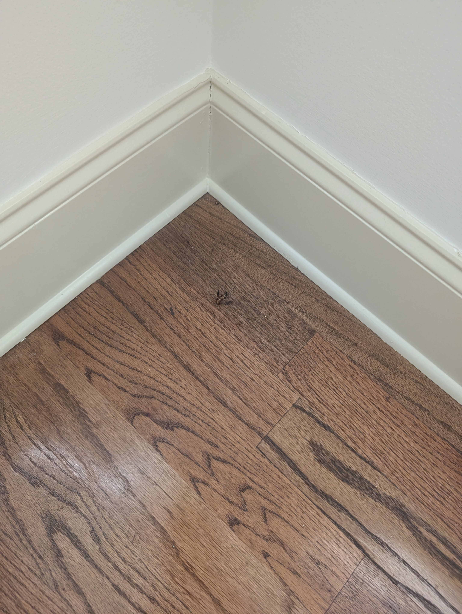
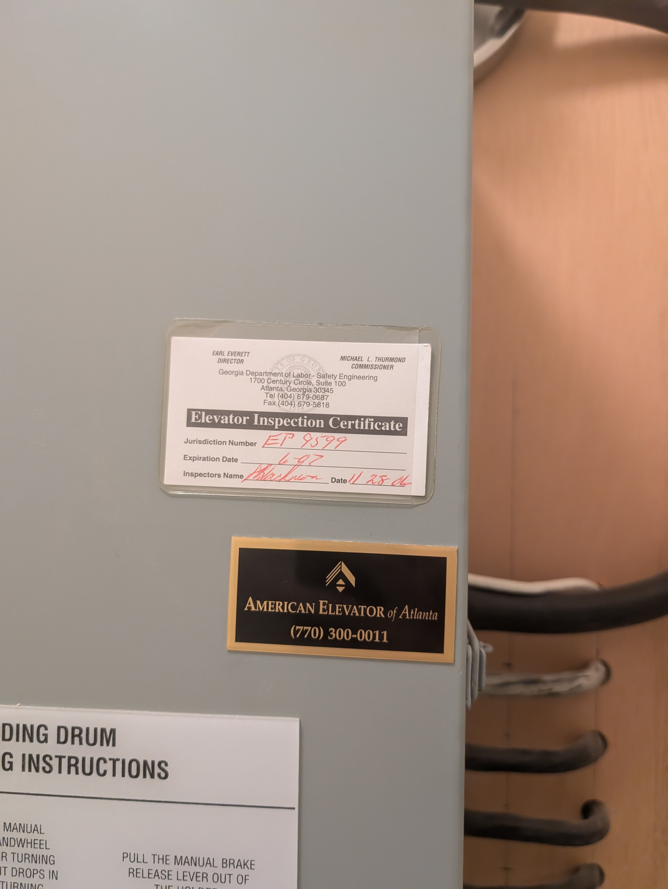

# Rankin Notes

## Main Floor

It looks like someone may have tried to kick in the front door.

Half-bath toilet tank lid has a crack.

Concerns about ice maker cleanliness.

The water was off, but until the water ran out, water flowed in the pipes when we used the faucets. No water flowed when we turned on the bar sink right handle.

This faucet on the kitchen sink was loose, and no water flowed when turning it on. 

Concerns about the discoloration in the dishwasher. Rust?

Painting needed around the porch door lock.

Crack in between bricks on porch.

Former(?) wasp nests on porch.

Wire jumble and cracked plate in cabinet to the left of the living room fireplace.

Audio/intercom system we'll probably want to remove.

Crack in moulding outside dining room window.

## Master Bedroom Floor

Outlet plate not flush with wall.

Door stop not flush with wall.

Knobs and handles in bathroom (and elsewhere in the house) are loose.

Bar in shower is held together with electrical tape.

Sealing around steam shower door loose.

Steam shower controls seem to be in error state.

Hot side of bathroom sink(s?) might not be working.

Crack in baseboard next to bathroom.

Tar-like substance in master closet.

## Top Floor

Dryer duct cleanliness.

Washer/dryer room sink may be clogged.

White spots on hallway floor.

Some light fixtures are askew.

Dead wasps and other insects in front bedroom.

Probably a missing door stop to cover this.

Toilet paper holder missing.

Crooked thing above blinds.

Crack near bathroom door.

Crack above bathroom door?

Light fixture askew.

Miscellaneous stuff on hot water closet.

Can't tell if window fogged or not.

Missing toilet paper holder.

Should anything be covering this hole?

Light switch plate not flush against wall.

## Basement Floor

Front storage room discoloration on metal ceiling.

Other storage room plate cover not flush to wall and bent in one corner.

Bathroom light fixture askew.

Carpet in closet.

Loose connection to air duct?

Elevator not inspected since 2006?

This switch doesn't seem to work. Or we don't know what it controls.

Possibly shoddy hole cut in baseboard. Entrance for bugs?

Cracks in baseboard.

Random wire sticking out of wall.

Stain on floor.

## Garage

Garage door opener doesn't seem to work.

Cracks.

Does this work? Is it clean?

Does this work?

## Outside

Does this work?

Dunno.

Dunno.

Does this box work?

Missing panel.

Wasps.

Light doesn't seem to work. Or we don't know which switch controls it.

Flashing on porch.

Discoloration on under windows.

Light is out.

What are these wires?
